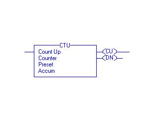

**Introduction**
Counters are used to count number of objects or to count cycles of a typical process. Consider an example of bottle filling plant, in that counter is used to count number of bottles filled in a particular batch.
In counter instruction the accumulated value will increase only when it completes the transition from open to close or vice versa. It doesn't check how long contact stay closed, it only looks for the transition. There are two basic types of counter
1.   Up-Counter (CTU)
2.   Down-Counter (CTD)

In Up counter when contact change over takes place accumulator value increments by one. While in down counter when changeover takes place accumulator value decrements by one.
The instruction blocks of up counter and down counter are as shown below.

**Count Up (CU) Bit:** - The Count Up enable bit indicates the CTU instruction is enabled. The data type used is Boolean indicated as BOOL.
**Count Down (CD) Bit:** - The Count Up enable bit indicates the CTD instruction is enabled.
**Done (DN) Bit:** - The done bit changes state whenever the accumulated value reaches the preset value. The data type used is Boolean indicated as BOOL.
**Overflow (OV) Bit:** - The overflow bit indicates the counter exceeded the upper limit of 2, 147, 483, 647. The counter then roles over to -2, 147, 483, 648 and begins counting up again. The data type used is Boolean indicated as BOOL.
**Underflow (UN) Bit:** - The underflow bit indicates that the counter exceeded the lower limit of -2, 147, 483, 647. The counter then roles over to 2, 147, 483, 647 and begins counting down again. The data type used is Boolean indicated as BOOL.
**Preset (PRE) Bit:** - It specifies the value which the accumulated value must reach before the instruction sets the done bit. The data type used is Double integer indicated as DINT.
**Accumulator (ACC) Bit:** - It specifies the number of transitions the instruction has counted.
The timing diagram illustrates the functioning of all the bits in sequence.

**Timing Diagram for Up Counter:-**

**Timing Diagram for Down Counter:-**

The following example, will illustrate the function of each bit of Up Counter after downloading the ladder and putting the PLC in run mode.

Here for every transition of start bit, counter accumulator value will be increased by one and for every count lamp 1 will glow on. When accumulator value becomes 5, lamp3 will glow on. To reset the counter and make accumulator value zero, reset bit is used.
The following example can illustrate the function of each bit for Down Counter.

Here accumulator value of CTD is 9. For each transition of start bit this value will be decremented by one. Whenever start bit becomes on, lamp1 will glow on. Lamp3 will remain on till accumulator Value becomes greater than or equal to preset value. When it becomes less than preset then lamp3 will glow off.
**The Function Block Diagram, Timing diagrams, and ladder diagram solutions are as per the available PLC(Rockwell Automation) in College of Engineering Pune.**

