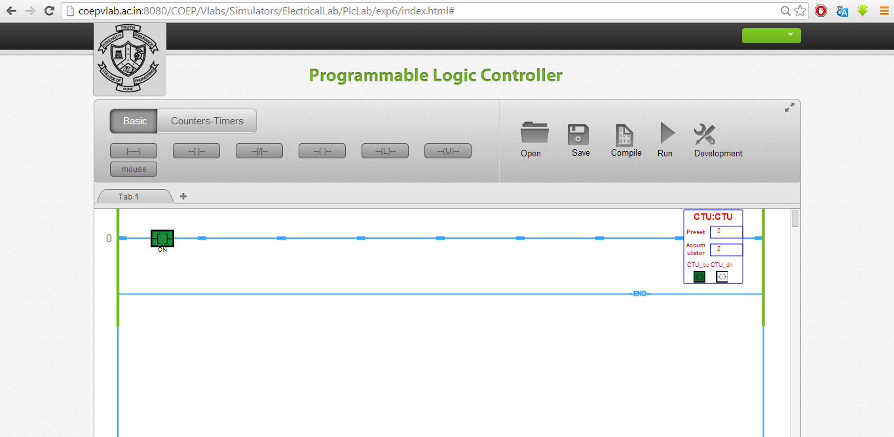

### Implement the counter using Simulator
The counter counts the pulses received at input. The pulses can be given by toggling the input bit "ON" in this case.
The counter will keep on counting till it reaches the preset value set by the user. Once the accumulator is equal to preset the DN bit will be energised.
After this instant if next pulse is detected the accumulator will increment without changing the status of DN bit.
To reset the counter use "Reset" command so that the counter can be configured for new counts without reloading the Page.
Please note the tag of the reset bit must be the tag of counter e.g."CTU".
The screen shot will appear as shown below.

In case of down counter the entire procedure will remain same. Only the number of counts are to be entered in the accumulator tab. The preset value is zero. When the input contact closes, the accumulator will go on decrementing, will reach to zero '0' value and the status of done bit will change.
To reset the DN counter use "Reset" command so that the counter can be configured for new counts without reloading the page. Please note the tag of the reset bit must be the tag of counter.

